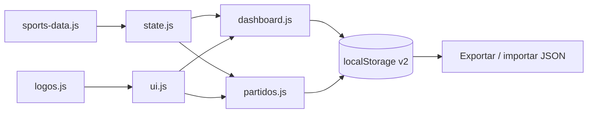

# Ratio Sports — Centro de seguimiento deportivo

Dashboard estático para GitHub Pages que centraliza equipos, torneos y una bitácora editable de partidos.

## Arquitectura

```text
assets/js/
├── config/logos.js          # rutas, alias y estado de torneos
├── data/sports-data.js      # catálogo y partidos semilla
├── core/
│   ├── state.js             # modelo, almacenamiento versionado y estadísticas
│   ├── ui.js                # tema, logos, banderas y helpers compartidos
│   └── backup.js            # importar/exportar JSON
└── pages/
    ├── dashboard.js         # controlador exclusivo del resumen
    └── partidos.js          # controlador exclusivo de la bitácora
```



## Mejoras de esta versión

- La lógica compartida ya no está duplicada entre páginas.
- El seguimiento semanal se calcula desde `matches`; no existe `EXCEL_WEEKS` hardcodeado.
- Almacenamiento con `schemaVersion: 2` y migración de claves anteriores.
- Botones de **Exportar JSON** e **Importar JSON** para respaldar la bitácora.
- Función central `escapeHtml()` para valores dinámicos.
- CSS común en `base.css`; cada página conserva únicamente sus ajustes específicos.
- Un solo `<!DOCTYPE html>` por página.

## Flujo de datos

1. `sports-data.js` proporciona los partidos iniciales.
2. `state.js` carga esos datos y combina altas manuales guardadas.
3. Las estadísticas generales y semanales se recalculan desde la bitácora actual.
4. Al agregar o eliminar un partido se actualiza `localStorage`.
5. Exportar JSON genera un respaldo con partidos, estados de torneos y versión del esquema.

## Respaldo

Use **Exportar JSON** antes de limpiar el navegador o cambiar de dispositivo. Para restaurar, pulse **Importar JSON** y seleccione ese archivo.

## Logos y alias

Los nombres de la bitácora se normalizan con minúsculas, sin acentos y guiones bajos. Los alias manuales en `assets/js/config/logos.js` tienen prioridad; si no hay alias se intenta automáticamente:

```text
logos/rivales/<nombre_normalizado>.png
```

Ejemplo: `Atlético de Madrid` → `logos/rivales/atletico_de_madrid.png`.

## GitHub Pages

1. Suba todo el contenido a la rama publicada.
2. Abra **Settings → Pages**.
3. Seleccione **Deploy from a branch** y la carpeta raíz `/`.
4. No abra los HTML con `file://`; use GitHub Pages o un servidor local.

Servidor local opcional:

```bash
python -m http.server 8000
```

## Validación rápida

```bash
node --check assets/js/core/state.js
node --check assets/js/core/ui.js
node --check assets/js/pages/dashboard.js
node --check assets/js/pages/partidos.js
```


### Renderizado seguro

`SportsCore.escapeHtml()` es la única función de escape usada por los controladores y helpers compartidos. Los atributos dinámicos también pasan por `escapeAttr` (alias de escape para contexto HTML). Los errores de carga de imágenes alternan elementos preconstruidos en vez de inyectar cadenas mediante `innerHTML`.

### Partidos decisivos

La propiedad `titleDecision` es la fuente única de verdad para determinar finales o partidos que deciden un título. No se usan prefijos de IDs.
